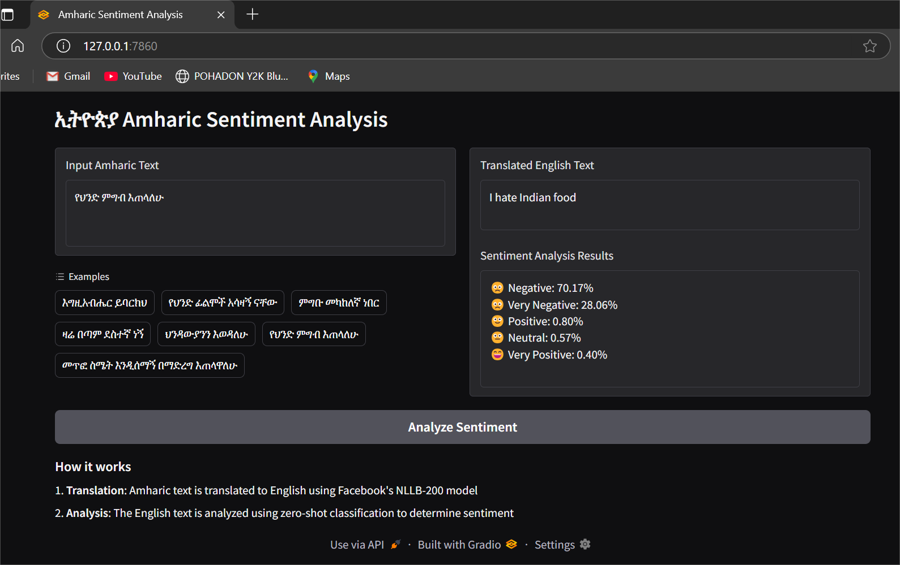

# Amharic Sentiment Analysis



## Overview

This repository contains a Python-based tool for performing sentiment analysis on Amharic text. Amharic is the official language of Ethiopia and one of the Semitic languages spoken in the Horn of Africa region.

## Features

* **Sentiment classification**: Classify Amharic text as positive, negative, neutral, very positive, or very negative
* **Polarity scoring**: Show confidence scores for each sentiment category
* **Two implementation approaches**:
  * Fine-tuned model specifically trained on Amharic data
  * Translation + zero-shot classification pipeline for quick implementation

## Demo

The project includes a Gradio-based web interface that demonstrates the functionality:

1. Enter Amharic text in the input field
2. Click "Analyze Sentiment"
3. View the translated English text and detailed sentiment analysis results

## Implementation Approaches

### 1. Fine-Tuned Model Approach

The primary approach uses a model fine-tuned specifically on Amharic sentiment data:

* **Word Vectors**: Uses FastText embeddings which have shown better results for the Amharic language
* **Training Data**: Custom dataset of labeled Amharic text (available in the `data` folder)
* **Model Architecture**: Neural network with embedding layer using FastText vectors

Note: The FastText model is not included in this repository due to its large size but can be found on the [FastText website](https://fasttext.cc/docs/en/crawl-vectors.html).

### 2. Quick Implementation Approach

For users who prefer a simpler implementation without fine-tuning details, the `hugging_face` folder provides a translation-based pipeline:

1. **Translation Step**: Convert Amharic text to English using Facebook's NLLB (No Language Left Behind) model
2. **Classification Step**: Apply zero-shot classification on the translated English text using DeBERTa-v3-base-mnli-fever-anli

This approach requires less setup and domain expertise while still providing reasonable results.

## How It Works

1. **Translation**: Amharic text is translated to English using Facebook's NLLB-200 model
2. **Analysis**: The English text is analyzed using zero-shot classification to determine sentiment
3. **Results**: Sentiment scores are displayed for multiple categories (Negative, Very Negative, Positive, Very Positive, Neutral)

## Installation

```bash
# Clone the repository
git clone https://github.com/yourusername/amharic-sentiment-analysis.git
cd amharic-sentiment-analysis

# Create a virtual environment
python -m venv venv
source venv/bin/activate  # On Windows: venv\Scripts\activate

# Install dependencies
pip install -r requirements.txt

# Download necessary models (if not included)
python download_models.py
```bash 
